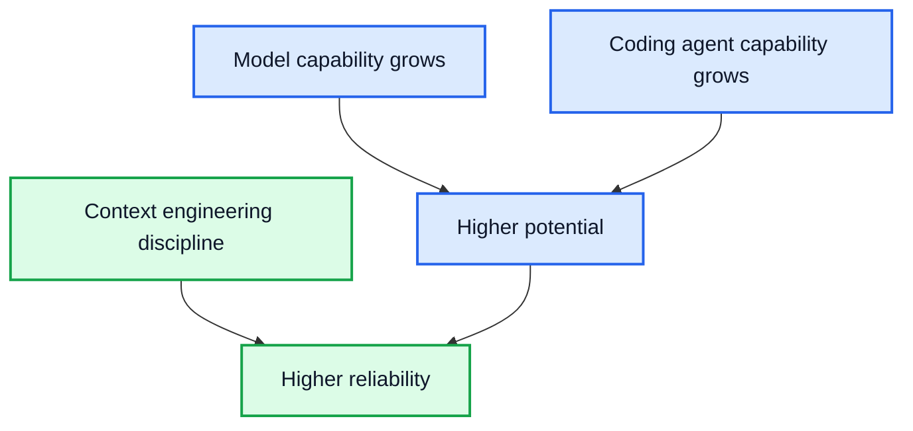
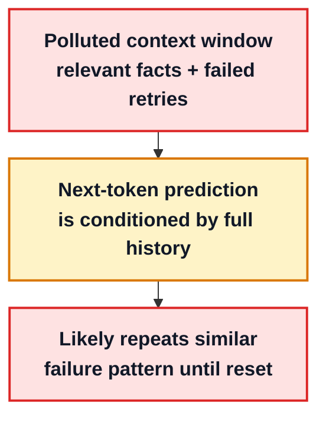
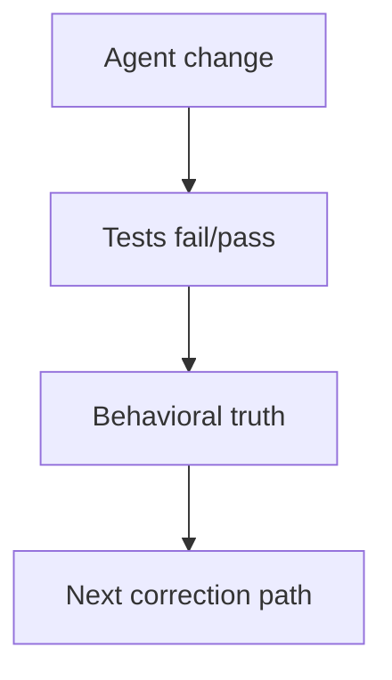
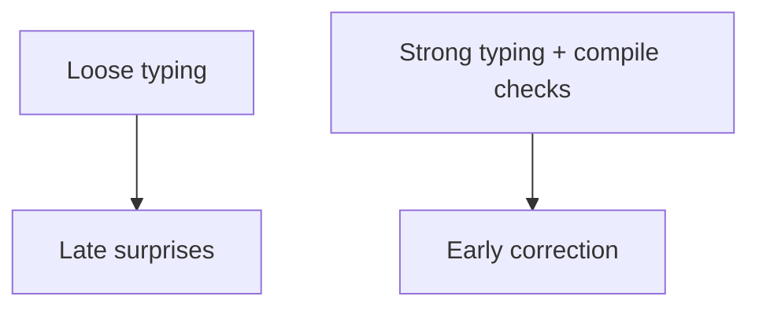

---
layout: center
class: relative
---

# Context Engineering with Codex: In Practice

Reliable outcomes with coding agents

---
layout: two-cols
class: relative
---

# About me

::right::

- Senior Software Engineer

- 4 years at Yext/Hearsay

- Apex team (Embedded Relate)

- ~90% of "my" code is generated by agents

---
layout: center
---

# Poll Results

  

---
layout: center
---

# Hot takes from Reddit

- "It just can't do anything complex in large production code bases... even with all the hype, it ends up being an utter waste of time."
- "The codebase becomes messy... unnecessary code, duplicated files... At this point, I would rather write the code myself."
- "No, you have to be a bad developer to use AI, because it's the only way not to notice that 70% of what it creates is just objectively wrong."

---
layout: center
---

# My goal for today

- Reframe "agents are dumb"
- Build a practical mental model
- Decide what works, when, and why
- Share tested tactics from real projects

---
layout: two-cols
class: relative
---

# Mental model

- LLM
    - Predicts next token
    - Based on current context
- Agent (simplified)
    - LLM
    - Instructions (system prompt)
    - Loop logic
    - Tools
    - Stopping rules
- Agent knows only
    - What is in context
    - What it pulls in via tools

::right::

  <strong>Agent Execution Loop</strong>
  <AgentExecutionLoopSim />

---
layout: default
class: relative
---

# Why Agents Cannot Produce Quality Code

<ContextWindowStackSim />

---
layout: two-cols
zoom: 0.9
---

# Context Engineering: Practical Definition

**Definition**

- Context engineering is the deliberate design and optimization of information fed into an AI system for reliable output
**In practice**

- Select what enters context
- Order for salience
- Compress history into artifacts
- Scope instructions and tools

**Janitor posture**

- We are context window janitors
- Reduce noise and drift continuously
- Protect context budget as an operating constraint

::right::

  

---
layout: two-cols
---

# Why Context Engineering Still Matters

**No matter how good models and agents get, results are still better with context engineering.**

**What improves externally**
- Models improve
- Coding agents improve (`OpenCode`, `Codex`, `Claude Code`)

**What I control directly**
- Context selection and ordering
- Compaction and handoff quality
- Scope and noise control

::right::

---
layout: two-cols
---

# Context Engineering

## Techniques and Practices

- 40% Rule and Session Reset
- Do Not Steer the Wheel
- Compaction: auto and manual
- Reference What Matters
- Subagents = Context Isolation
- MCP minimization
- Nested AGENTS.md
::right::

## Workflows

- Research Pan Implement
- Spec Driven Development

---
layout: two-cols
zoom: 0.9
---

# 40% Rule and Session Reset

**Hard threshold behavior**
- Track usage continuously
- At 40%, switch strategy immediately
- 40% is an early warning, not a max limit

**Why so early**
- Reasoning degrades before the window is full
- Capacity is not the same as thinking quality

**Reset sequence**
- Close side threads
- Compact to handoff artifact
- Continue in clean session

::right::

  <ContextFortyPercentDecisionFlow />

---
layout: two-cols
zoom: 0.9
---

# Do Not Steer the Wheel

**What "steering" means (bad practice)**
- Naive Ask -> Correct -> Ask in polluted history
- Re-fixing failed attempts in same session
- Arguing with drift instead of reset

**Why it fails**
- Failed attempts bias next-token prediction
- Repeated failures reinforce failure patterns

**Operator protocol**
- Stop naive loop early
- Extract learnings into a stronger next prompt
- Drop/revert local attempt
- Restart fresh session with clean handoff
- Avoid extra high thinking

::right::

---
layout: two-cols
zoom: 0.9
---

# Compaction Auto and Manual

**Auto compaction helps**
- Fast baseline continuity
- Useful when context is still coherent

**Manual compaction is operator control**
- Ask for explicit handoff when needed
- In Codex CLI, use `/compact` for manual compaction
- Keep only decisions, facts, and next actions
- Drop dead branches and noisy traces

**Key point**
- Compaction is not only token reduction
- It is a relevance reset

::right::

  <CompactionSim />

---
layout: two-cols
---

# Reference What Matters

**Anchoring behavior**
- Reference exact files, symbols, and boundaries
- Avoid blind exploration when scope is known

**Why it works**
- Higher relevant coverage
- Lower noise in loaded context
- Lower drift probability

::right::

  <ContextCoverageBlocksSim />

---
layout: two-cols
---

# Subagents = Context Isolation

- Not roleplay ("QA agent", "frontend agent")
- Fork a clean context for wide research
- Do heavy reading/search outside parent thread
- Return one compact artifact to parent
- Goal: protect main context quality

::right::

<SubagentFilterFunnelSim />

---
layout: two-cols
layoutClass: mcp-minimization-grid
zoom: 0.9
---

# MCP Minimization and Tool Tax

**Session-scoped MCP policy**
- Enable only MCP servers needed for the current task
- Disable unused integrations for this session

**Tool tax principle**
- Unused tool definitions consume context budget
- Descriptions and schemas are context tax

**Quality impact**
- Lower upfront context load
- Better signal density before work starts

**Alternative**

- Agent skills are loaded lazyly
  - E.g. over GitHub MCP prefer `gh` + GitHub skill

::right::

<McpToolTaxToggleSim />

---
layout: two-cols
---

# Nested AGENTS.md

**Instruction scoping strategy**
- Keep root `AGENTS.md` minimal
- Move domain rules into nested `AGENTS.md`
- Keep narrow-scope guidance near the work area

**Practical loading control**
- Use `cwd` / `cd` strategy for scope-local sessions
  - Autoloading nested: `openai/codex/issues/12115`
- Load only instructions relevant to current boundary

::right::

<NestedAgentsScopeComparisonSim />

---
layout: center
---

# The Master Workflow: R.P.I.

- Move from prompt guessing to workflow engineering
- Frequent compaction keeps the agent in the Smart Zone
- Goal: avoid Context Rot and the Dumb Zone

	<RpiWorkflowStepper />

---
layout: two-cols
zoom: 0.95
---

# Choose the Right Workflow

**Rule of thumb**
- More complexity -> more process
- More touched areas -> more filtering
- More requirements -> more explicitness
- More context gathered -> more noise to control

**Escalate with the task**
- Color change -> direct execution
- Context-aware replace -> inspect + short plan
- Core service refactor -> research + plan
- Complex feature -> PRD/spec + research + plan + implement
- Brownfield critical feature -> add characterization tests first

::right::

  

    

      
Lightweight

      
Change a color

      
Direct execution

    

    

      
Moderate

      
Context-aware replace

      
Inspect surface + short plan

    

    

      
Heavy

      
Refactor core service

      
Research + plan first

    

    

      
Heavier

      
New complex feature

      
PRD/spec -> research -> plan -> implement

    

    

      
Heaviest

      
Brownfield critical feature

      
PRD/spec -> research -> characterization tests -> plan -> implement

    

  

---
layout: center
---

# Building an Agent-Native Codebase

Code quality is context quality

**Thesis**

- Ancient wisdom still relevant: best practices matter more than ever
- The repository influences agent output more than prompt cleverness
- Architecture quality matters more than agent preset or model choice
- Reliability comes from feedback loops, not from optimism

---
layout: two-cols
zoom: 0.9
layoutClass: agent-mental-model-grid
---

# Agent mental model

**How to model an agent**

- Treat it as a top-tier newcomer with no prior project memory
- It can only reason from evidence loaded in the current context
- It works inside a limited context window, not durable memory
- It implements quickly, but assumptions drift without feedback

**Design consequence**

- Optimize for fast context rehydration on each task
- Keep boundaries, invariants, and owners explicitly visible

::right::

---
layout: two-cols
---

# Prime directive

## The code must not lie

**What truthful codebase structure means**

- Folder names should reflect real responsibility and ownership
- File names should follow behavior, not historical accidents

**Why this matters**

- Hidden caveats create expensive and error-prone exploration
- Honest structure reduces wrong edits and token waste

::right::

<PrimeDirectiveTruthSim />

---
layout: two-cols
---

# Terminology consistency

**Consistency rules**

- Prompt wording should match repository vocabulary exactly
- One concept should keep one canonical name across all artifacts

**Operational practice**

- Keep code, docs, and tickets aligned on the same terms
- Maintain a small domain glossary and evolve it intentionally

::right::

  <TerminologyConsistencySim />

---
layout: two-cols
---

# Noise reduction rules

**What to remove continuously**

- Hunt dead code regularly and delete it without ceremony
- Ask agents explicitly to clean implementation leftovers

**What to restructure proactively**

- Large files hide critical details and slow safe edits
- Treat naming and structure hygiene as ongoing operations

::right::

  <NoiseReductionSim />

---
layout: two-cols
---

# Guardrails I

## Unit Tests

**Why tests matter most**

- Tests are the living specifications, executable product knowledge

**What to enforce**

- Use characterization tests for risky legacy zones
- Failing output should explain what changed
- Guardrail means not only passing tests, but also meeting minimum coverage

::right::

---
layout: default
---

# Guardrails II

## Lint, static, pre-commit

**Discipline layer**

- Strong linting and static checks should be easy to run locally
  - Take the time to properly configurate
- Define unavoidable guardrail processes like pre-commit hooks
  - Commit by small logical slices during session
  - Avoid `--no-verify`

**Execution style**

- Keep CI checks aligned with local checks to reduce surprises
- Ensure failures are actionable instead of cryptic

---
layout: two-cols
---

# Guardrails III

## Types + compilation

**Machine-checkable truth**

- Strong typing provides immediate feedback on design correctness
- Prefer TypeScript over JavaScript when the stack allows it
- In Python, push typing discipline as far as practical

**Loop design**
- Be aware of time needed, adjust agent rules

::right::

---
layout: two-cols
zoom: 0.8
---

# Guardrails IV

## Language Server Protocol

LSP provides structured semantic guardrails for agents operating in large codebases.

**Navigation capabilities**

- Semantic navigation
  - Definitions, references, symbols, call hierarchy
  - Enables precise context retrieval and safer impact analysis
- Incremental diagnostics
  - File scoped, low latency feedback
  - Reduces full rebuild loops and tightens edit validate cycles
- Protocol abstraction layer
  - One standardized surface for errors and symbols across languages
  - Simplifies agent integration and improves portability

::right::

**Implementation option**

- LSP still not supported in Codex
  - There is an open issue: `openai/codex/issues/8745`
  - Theoretically an MCP bridge can be used

---
layout: default
---

# `AGENTS.md`

**Mental model**

The `AGENTS.md` file is a stateless onboarding guide for a "smart newcomer": compressed map, team opinions, and steering rules.

**What belongs in `AGENTS.md`**

- Gotchas pile (most critical)
- Specific command instructions
- High-level maps
- Progressive disclosure

**Antipatterns**

- `/init` output dump
- Full documentation site
- Re-documenting source-of-truth code
- Outdated information

---
layout: two-cols
class: relative
---

# Self-verification (UI + runtime)

**Tooling options**

- Playwright MCP
- Chroome devtools MCP

**Assertions and interaction**

- Planned flow works
- Network: status + expected responses
- Console errors = failures
- Taking screenshots

::right::

**Debugger limits (today)**

- Devtools MCP cannot use breakpoints/stepping
- Agent loop can’t replicate debugger UX

**Experimental extensions**

- Unofficial “debugger MCP” exists for node.js
- Evaluate cautiously before adoption

---
layout: default
zoom: 0.77
---

# Classic software design still wins

1. Navigation and understanding mechanism: easier discovery, targeted edits, fewer side effects
2. Token-shaping mechanism: context code patterns directly bias next-token output quality

- **Information hiding** → deep modules (simple interface, lots hidden)
- **Clean Code / SOLID** → readable design, clear responsibilities, safer changes
- **Dependency inversion / ports & adapters** → boundaries & seams (integration points you can swap/mock)
- **Functional core, imperative shell** → minimize IO surface, maximize deterministic tests

  <FlowerExtrapolationTabs />

---
layout: center
---

# Other techniques and practices

- Useful patterns beyond strict context engineering
- Practical habits worth adopting

---
layout: default
class: relative
---

# Testing

  

    
Test-driven development

    <ul class="space-y-2 text-[0.95em]">
      <li>Protect agains common agents mistakes</li>
      <ul class="space-y-2 ml-10 text-[0.8em]">
      <li>Write code that doesn't work</li>
      <li>Build unnecesssary code</li>
          </ul>
    </ul>
    <li>Red phase proves that we cover a real gap, that agent may not realize otherwise</li>
  

  

    
First run the tests

    <ul class="space-y-2 text-[0.95em]">
      <li>Put agent to testing mindset</li>
      <li>Forces agent to find test harness</li>
      <li>Signals project size and complexity</li>
      <li>Encourages search of existing tests</li>
    </ul>
  

---
layout: default
---

# Prompting and algorithmic work

  

    
Prompting as practice

    <ul class="space-y-2 text-[0.95em]">
      <li>Ask ChatGPT to improve prompts</li>
      <li>Keep a versioned prompt collection</li>
      <li>Reuse prompts that worked before</li>
    </ul>
  

  

    
Create competition

    <ul class="space-y-2 text-[0.95em]">
      <li>Run the same task with 2 or more prompt variants</li>
      <li>Compare the resulting approaches</li>
      <li>Keep the stronger result</li>
    </ul>
  

  

    
Large data rule

    <ul class="space-y-2 text-[0.95em]">
      <li>Don’t dump large data into chat</li>
      <li>Ask the agent to write a script</li>
      <li>Process it algorithmically outside context</li>
    </ul>
  

---
layout: default
---

# Skills

  

    
Creating skills with agents

    <ul class="space-y-2 text-[0.95em]">
      <li>A skill turns tacit know-how into explicit instructions</li>
      <li>When re-read, that guidance becomes active session context</li>
      <li>Explicit process beats hoping the right pattern appears</li>
    </ul>
  

  

    
Security caveats

    <ul class="space-y-2 text-[0.95em]">
      <li>Do not install third-party skills blindly</li>
      <li>Popularity metrics and recommendations can be manipulated</li>
      <li>Global installs can activate outside the project you intended</li>
      <li>Read the skill before trusting the workflow it triggers</li>
    </ul>
  

---
layout: center
class: text-center
---

# Questions?

---
layout: center
class: text-center
---

# Thanks for the attention
